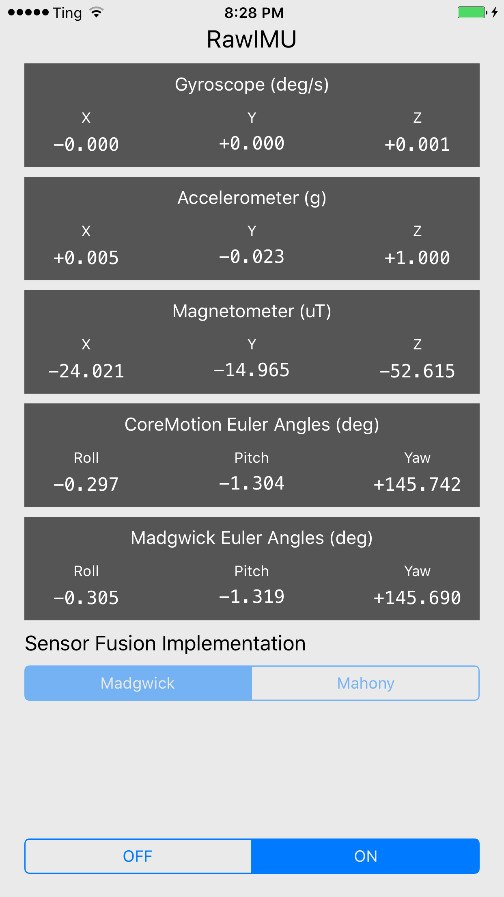

# RawIMU

[](https://raw.githubusercontent.com/softwarenerd/RawIMU/master/LICENSE.md) 

RawIMU is a test program for the [Fused](https://github.com/softwarenerd/Fused) iOS framework. [Fused](https://github.com/softwarenerd/Fused) is an iOS Framework that contains Objective-C ports of MadgwickAHRS and MahonyAHRS. The original C implementations of MadgwickAHRS and MahonyAHRS can be found [here](http://www.x-io.co.uk/res/sw/madgwick_algorithm_c.zip).



## Getting Started

RawIMU uses [Carthage dependency manager](https://github.com/Carthage/Carthage). Follow the [Carthage build instructions](https://github.com/Carthage/Carthage#if-youre-building-for-ios-tvos-or-watchos) for building for iOS.

#### Clone RawIMU

`~/Code git clone git@github.com:softwarenerd/RawIMU.git`

## Logging

RawIMU provides detailed logging so you can compare its performance to CoreMotion.

```
-------------------------------------------------------------------------
CoreMotion Raw Data
-------------------------------------------------------------------------
     Gyroscope (rad/s): X:     -0.00190, Y:      0.00046, Z:     -0.00012
     Gyroscope (deg/s): X:     -0.10902, Y:      0.02641, Z:     -0.00687
     Accelerometer (g): X:     -0.00713, Y:     -0.00180, Z:     -0.99997
     Magnetometer (uT): X:    -33.51311, Y:    -24.53882, Z:    -22.25294
-------------------------------------------------------------------------
Madgwick / CoreMotion Comparison
-------------------------------------------------------------------------
      Madgwick Roll (deg):    359.59784
    CoreMotion Roll (deg):    359.59158
---------------------------------------
     Madgwick Pitch (deg):      0.09470
   CoreMotion Pitch (deg):      0.10312
---------------------------------------
       Madgwick Yaw (deg):    143.78024
     CoreMotion Yaw (deg):    143.92413
```

## License

RawIMU is released under the [GNU General Public License](LICENSE.md).
